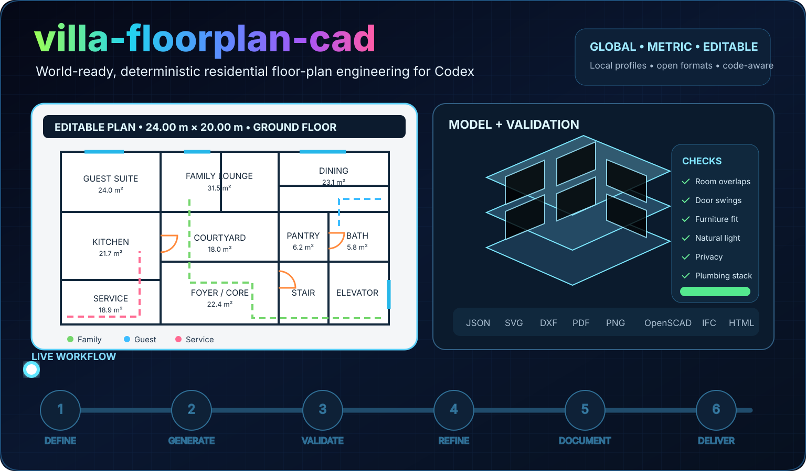
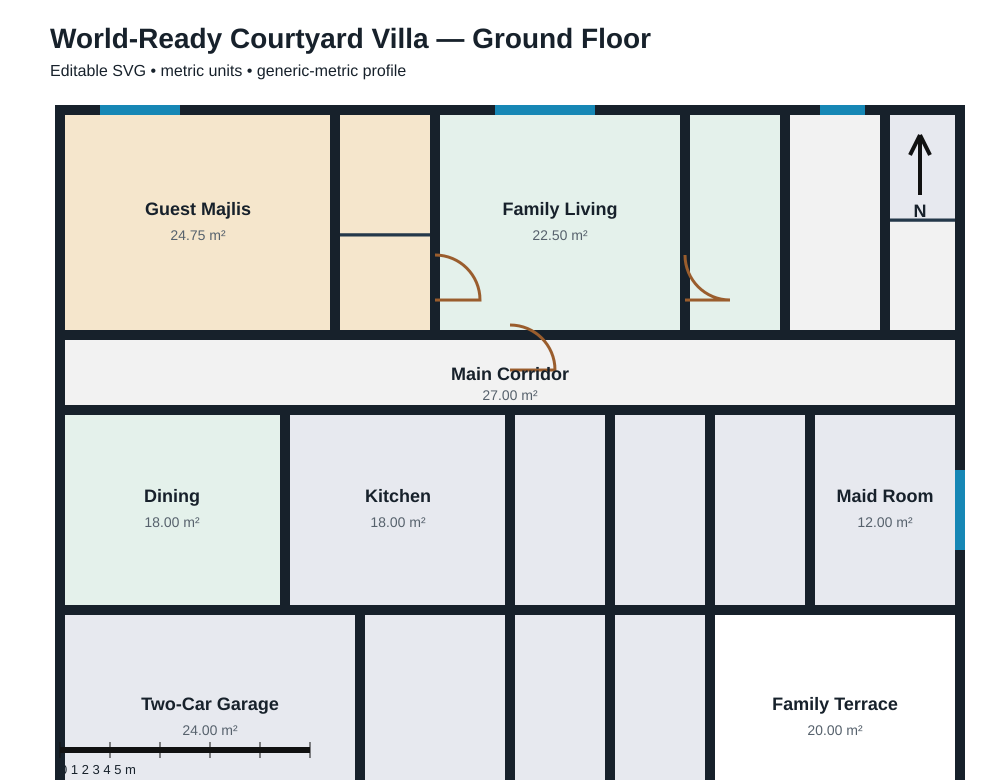
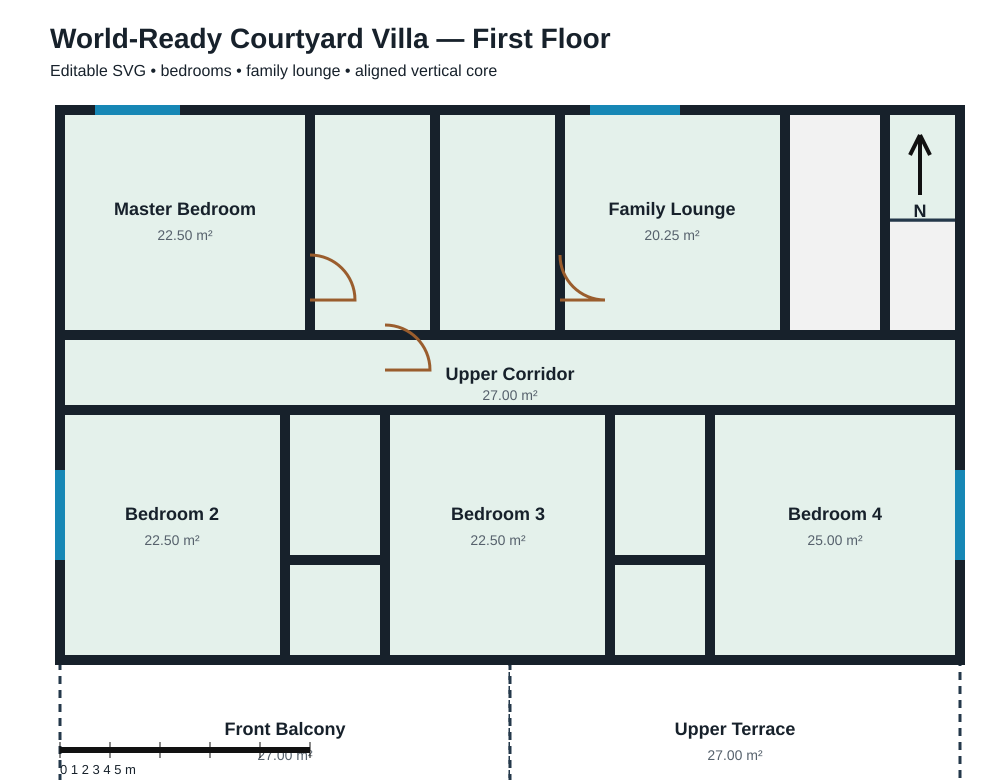

<div align="center">

# villa-floorplan-cad

**A metric, deterministic Codex skill for residential villa planning, validation, editable drawings, CAD export, and safe project sharing.**

[](https://github.com/Nasser934/villa-floorplan-cad/actions/workflows/ci.yml)
[](./requirements.txt)
[](#metric-only)
[](#jurisdiction-profiles)
[](./LICENSE)



**Program → canonical plan → validation → editable outputs → review package**

[Quick start](#quick-start) · [Architecture](#product-architecture) · [Outputs](#outputs) · [Sharing](#safe-sharing) · [Validation](#validation) · [Profiles](#jurisdiction-profiles)

</div>

---

## What it does

`villa-floorplan-cad` turns a structured residential brief into one canonical `plan.json`. Every drawing, model, report, and viewer is generated from that same geometry.

It supports:

- Building programming and residential room schedules.
- Guest, family, shared, service, and external zoning.
- Room adjacency, access, circulation, storage, and service planning.
- Furniture, fixture, door-swing, lighting, ventilation, plumbing-stack, stair, elevator, and parking checks.
- Editable SVG and DXF plans.
- PDF drawing sets and PNG previews.
- OpenSCAD massing and optional IFC4 export.
- A self-contained local 2D/3D review viewer.
- Client-safe and complete editable ZIP packages.

> This is a concept-design and coordination tool. It does not certify permit approval, structural safety, fire safety, accessibility, energy performance, or detailed MEP design.

## Product architecture

The architecture deliberately stays small:

```text
program.json
    ↓
generate_plan.py
    ↓
plan.json  ← single geometry contract
    ├── validate_plan.py
    ├── render_svg.py / PNG
    ├── export_dxf.py
    ├── export_pdf.py
    ├── export_openscad.py
    ├── export_ifc.py (optional)
    └── viewer + share ZIP
```

### Core rule

`program.json` is the editable design input. `plan.json` is generated and becomes the only geometry source for all outputs.

This prevents PDF, DXF, SVG, OpenSCAD, IFC, the viewer, and future Blender exports from drifting apart.

### Adapter rule

IFC, Blender, Blender MCP, photorealistic rendering, and visual AI review remain optional adapters. They read `plan.json`; they do not create a second geometry model.

Read the full [product and architecture review](./docs/PRODUCT-DESIGN-REVIEW.md).

## Quick start

### Install as a Codex skill

```bash
npx skills add Nasser934/villa-floorplan-cad -a codex
```

Manual installation:

```bash
git clone https://github.com/Nasser934/villa-floorplan-cad.git
mkdir -p ~/.codex/skills
cp -R villa-floorplan-cad ~/.codex/skills/villa-floorplan-cad
```

### Install core dependencies

```bash
python -m pip install -r ~/.codex/skills/villa-floorplan-cad/requirements.txt
```

Optional IFC support:

```bash
python -m pip install -r ~/.codex/skills/villa-floorplan-cad/requirements-ifc.txt
```

Development and tests:

```bash
python -m pip install -r ~/.codex/skills/villa-floorplan-cad/requirements-dev.txt
```

### Create a project

```bash
python ~/.codex/skills/villa-floorplan-cad/scripts/create_project.py \
  --root . \
  --project-dir my-villa \
  --profile generic-metric \
  --location "Your city, country"
```

This creates:

```text
my-villa/
├── source/          # private original drawings
├── program.json     # editable design input
├── villa-cad.json   # project paths and profile
├── output/          # generated files
├── viewer/          # local review viewer
└── share/           # ZIP packages
```

### Generate everything

```bash
python ~/.codex/skills/villa-floorplan-cad/scripts/generate_report.py my-villa
```

Add IFC only when its optional dependencies are installed:

```bash
python ~/.codex/skills/villa-floorplan-cad/scripts/generate_report.py my-villa --ifc
```

### Review locally

Open:

```text
my-villa/viewer/index.html
```

Or serve the project:

```bash
python -m http.server 8000 --directory my-villa
```

Then open `http://localhost:8000/viewer/index.html`.

## Safe sharing

Create a client-review package:

```bash
python ~/.codex/skills/villa-floorplan-cad/scripts/generate_report.py \
  my-villa \
  --share review
```

The review ZIP includes:

- Local viewer.
- PDF drawing set.
- SVG and PNG floor plans.
- Validation result.
- Share manifest.

It excludes:

- `source/` drawings.
- `program.json`.
- `plan.json`.
- DXF, OpenSCAD, and IFC files.

Create a complete editable package only when intended:

```bash
python ~/.codex/skills/villa-floorplan-cad/scripts/generate_report.py \
  my-villa \
  --share full
```

Both packages use project-relative paths and always exclude `source/`.

## Outputs

| Output | Purpose | Editable |
|---|---|:---:|
| `output/plan.json` | Canonical geometry and metadata | Yes |
| `output/<floor>.svg` | Layered floor drawing | Yes |
| `output/<floor>.dxf` | Metric CAD drawing | Yes |
| `output/<floor>.png` | Preview image | No |
| `output/villa-drawing-set.pdf` | Multi-page drawing set | No |
| `output/villa-model.scad` | Neutral 3D massing model | Yes |
| `output/villa-model.ifc` | Optional IFC4 model | Yes |
| `output/validation.json` | Machine-readable issues | Yes |
| `output/artifact-manifest.json` | Relative output index | Yes |
| `viewer/index.html` | Self-contained review viewer | Yes |

### Sample plans

<table>
<tr>
<td width="50%"></td>
<td width="50%"></td>
</tr>
<tr>
<td align="center"><strong>Ground floor</strong></td>
<td align="center"><strong>First floor</strong></td>
</tr>
</table>

See the [sample program](./examples/world-ready-villa/program.json).

## Validation

The validator checks:

- Overlapping rooms and footprint containment.
- Disconnected rooms and missing doors.
- Door-to-door and door-to-furniture collisions.
- Furniture fit and furniture collisions.
- Narrow corridors and lobbies.
- Natural light and wet-room ventilation.
- Storage provision and service-route length.
- Kitchen-to-dining connection.
- Guest, family, and service privacy conflicts.
- Plumbing-stack alignment.
- Stair and elevator conflicts or vertical misalignment.
- Room areas and missing dimensions.
- Parking and external access.

Release gate:

```bash
python scripts/validate_plan.py \
  my-villa/output/plan.json \
  --output my-villa/output/validation.json \
  --fail-on error
```

## Project configuration

`villa-cad.json` controls project-relative paths:

```json
{
  "schema_version": "villa-floorplan-cad.project.v1",
  "program": "program.json",
  "output_dir": "output",
  "viewer_dir": "viewer",
  "share_dir": "share",
  "metric_only": true,
  "profile": "generic-metric"
}
```

Configured paths must remain inside the project folder.

## Jurisdiction profiles

The default is `generic-metric`. It makes no local-code approval claim.

Packaged profiles:

| Profile | Use |
|---|---|
| `generic-metric` | Worldwide metric concept work |
| `saudi-arabia` | Saudi residential review metadata and planning notes |

Example:

```bash
python scripts/create_project.py \
  --root . \
  --project-dir riyadh-villa \
  --profile saudi-arabia \
  --location "Riyadh, Saudi Arabia"
```

Custom profiles are supported through a JSON file. See [jurisdiction profile guidance](./references/jurisdiction-profiles.md).

## Metric only

- Lengths and coordinates: metres.
- Areas: square metres.
- Angles: degrees.
- Drawing scales: metric.
- OpenSCAD conversion to millimetres occurs only during export.

## Use with Codex

```text
Use $villa-floorplan-cad to create a two-storey metric villa.
Separate guest, family, and service circulation. Generate the plan,
run validation, create all editable outputs, and package a review ZIP.
```

```text
Use $villa-floorplan-cad to analyse this existing program.json.
Fix room overlap, door collisions, missing storage, poor kitchen-to-dining
access, and plumbing alignment. Preserve dimensions and regenerate outputs.
```

## Tests

```bash
python -m pytest -q
```

CI runs on Python 3.10, 3.11, and 3.12. The badge at the top shows the current repository result.

## Current limits

- Room geometry is axis-aligned.
- Raster/PDF tracing still needs human dimension checks.
- The viewer provides massing, not photorealistic rendering.
- Blender and Blender MCP are planned adapters, not core dependencies.
- IFC requires a compatible optional IfcOpenShell installation.

## Contributing

Read [CONTRIBUTING.md](./CONTRIBUTING.md). Keep geometry deterministic, metric-only, and generated from the canonical plan.

## License

MIT. See [LICENSE](./LICENSE).
