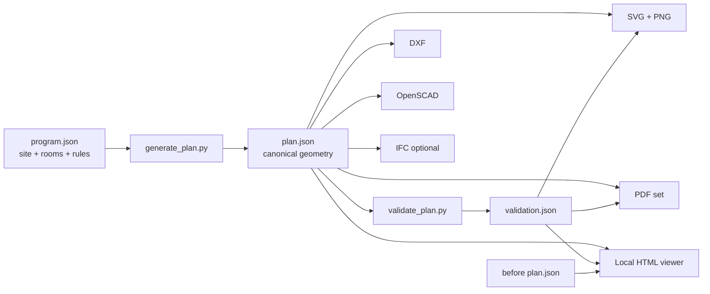

<div align="center">

# villa-floorplan-cad

**A production-ready Codex skill for deterministic residential villa planning, validation, CAD export, documentation, and local 2D/3D review.**

[](./SKILL.md)
[](#metric-only-by-design)
[](#world-ready-jurisdiction-profiles)
[](./requirements.txt)
[](#testing)
[](./LICENSE)


**Design → Analyse → Validate → Render → Export → Compare**

[Quick start](#quick-start) · [Outputs](#generated-outputs) · [Validation](#validation-engine) · [Viewer](#local-2d3d-viewer) · [Profiles](#world-ready-jurisdiction-profiles) · [Schema](./references/plan-schema.md)

</div>

---

## What it does

**villa-floorplan-cad** turns a structured residential brief into one canonical, dimensionally consistent `plan.json`, then generates editable drawings, CAD files, documentation, a 3D massing model, and a local review viewer from the same geometry.

It is built for architects, designers, engineers, developers, reviewers, students, and AI coding agents that need real plan data rather than a decorative floor-plan image.

- Metric units only: metres, square metres, and metric drawing scales.
- Deterministic generation: the same input creates the same ordered geometry and IDs.
- Editable outputs: JSON, SVG, DXF, OpenSCAD, and optional IFC.
- Residential planning logic: rooms, zoning, privacy, furniture, services, cores, parking, and access.
- Local-rule support: a generic worldwide baseline plus jurisdiction profiles.
- Repository-native workflow: all project inputs and outputs stay inside your current codebase.

> [!IMPORTANT]
> This skill supports concept design, coordination, and automated review. It does not certify code compliance, structural safety, fire safety, accessibility, energy performance, or permit approval. Apply current local requirements and professional review before construction.

## Workflow



The key rule is simple: **every output comes from the same canonical model**. This prevents the plan, dimensions, PDF, CAD file, and viewer from drifting apart.

## Core capabilities

| Area | Included |
|---|---|
| Building program | Site, floor count, rooms, target areas, room types, zones, access, parking, levels, and heights |
| Spatial planning | Deterministic room placement, adjacency relationships, circulation, external access, and vertical cores |
| Residential privacy | Guest, family, shared, service, vertical, and external zoning with conflict checks |
| Room fit | Calculated areas, furniture footprints, fixtures, clearances, doors, windows, and room dimensions |
| Services | Kitchen, dining, pantry, laundry, maid spaces, wet rooms, shafts, plumbing alignment, and route checks |
| Vertical coordination | Stairs, elevator, shafts, floor levels, slab thickness, clear heights, and parapets |
| Documentation | Room names, room areas, internal and overall dimensions, scale bar, north arrow, legend, issue markers, and title block |
| CAD/BIM | Layered SVG, metric DXF, OpenSCAD model, and optional IFC4 export |
| Review | Local 2D/3D viewer, room information, issue markers, floor selector, and before/after comparison |

## Generated outputs

A full run creates:

| File | Purpose | Editable |
|---|---|:---:|
| `output/plan.json` | Canonical floors, rooms, walls, openings, doors, windows, furniture, fixtures, dimensions, relationships, levels, and heights | Yes |
| `output/<floor>.svg` | Layered vector drawing for each floor | Yes |
| `output/<floor>.dxf` | Metric CAD drawing for each floor using `ezdxf` | Yes |
| `output/villa-drawing-set.pdf` | Multi-page drawing set with title block and annotations | No |
| `output/<floor>.png` | Fast visual preview | No |
| `output/villa-model.scad` | 3D slabs, walls, openings, stairs, elevator shaft, roof, and parapets | Yes |
| `output/villa-model.ifc` | Optional IFC4 model using IfcOpenShell | Yes |
| `output/validation.json` | Machine-readable issues and severity summary | Yes |
| `output/artifact-manifest.json` | Generated-file manifest and optional-export status | Yes |
| `viewer/index.html` | Local interactive review application | Yes |

### Sample plans

<table>
<tr>
<td width="50%"></td>
<td width="50%"></td>
</tr>
<tr>
<td align="center"><strong>Ground floor</strong></td>
<td align="center"><strong>First floor</strong></td>
</tr>
</table>

Inspect the editable [ground-floor SVG](./examples/world-ready-villa/output/ground-floor.svg), [first-floor SVG](./examples/world-ready-villa/output/first-floor.svg), and the [sample villa program](./examples/world-ready-villa/program.json). Run the pipeline locally to generate `plan.json`, PDF, PNG, DXF, OpenSCAD, IFC, reports, and the HTML viewer.

## Validation engine

The validator runs deterministic checks across 16 review groups:

1. Room overlap and footprint containment.
2. Disconnected rooms and unreachable spaces.
3. Missing doors for requested adjacencies.
4. Door-to-door and door-to-furniture collisions.
5. Furniture fit and furniture-to-furniture collisions.
6. Narrow corridors and lobbies.
7. Natural lighting for habitable rooms.
8. Kitchen, bathroom, WC, and laundry ventilation.
9. Storage provision against the configured floor-area ratio.
10. Long service routes.
11. Kitchen-to-dining distance and connection.
12. Guest, family, and service privacy conflicts.
13. Stacked plumbing alignment.
14. Stair, elevator, and shaft conflicts or misalignment.
15. Calculated room areas and missing dimensions.
16. Parking provision and external access.

Each issue includes a stable code, severity, message, floor, room IDs, and marker geometry where available.

```bash
python scripts/validate_plan.py \
  my-villa/output/plan.json \
  --output my-villa/output/validation.json \
  --fail-on error
```

Use `--fail-on warning` for a stricter CI gate.

## Quick start

### 1. Install as a Codex skill

After the GitHub repository is available:

```bash
npx skills add Nasser934/villa-floorplan-cad -a codex
```

Manual installation:

```bash
git clone https://github.com/Nasser934/villa-floorplan-cad.git
mkdir -p ~/.codex/skills
cp -R villa-floorplan-cad ~/.codex/skills/villa-floorplan-cad
```

### 2. Install Python dependencies

```bash
python -m pip install -r ~/.codex/skills/villa-floorplan-cad/requirements.txt
```

Dependencies:

- `ezdxf`
- `shapely`
- `svgwrite`
- `reportlab`
- `pillow`
- `numpy`
- `ifcopenshell` for optional IFC
- `pytest` for tests

### 3. Create a project

```bash
python ~/.codex/skills/villa-floorplan-cad/scripts/create_project.py \
  --root . \
  --project-dir my-villa \
  --profile generic-metric \
  --location "Your city, country"
```

### 4. Edit the brief

Update `my-villa/program.json` with your site, rooms, floor geometry, zones, target areas, connections, levels, standards, and local review metadata.

### 5. Generate everything

```bash
python ~/.codex/skills/villa-floorplan-cad/scripts/generate_report.py my-villa
```

Add IFC:

```bash
python ~/.codex/skills/villa-floorplan-cad/scripts/generate_report.py my-villa --ifc
```

### 6. Open the viewer

```bash
python -m http.server 8000 --directory my-villa
```

Open `http://localhost:8000/viewer/index.html`.

## Use with Codex

Example prompts:

```text
Use $villa-floorplan-cad to create a two-storey metric villa for a 25 m × 30 m plot.
Separate guest, family, and service circulation. Include 5 bedrooms, a guest majlis,
family living, dining, kitchen, pantry, laundry, maid room, storage, two-car parking,
a stair, and an elevator. Use the generic-metric profile and document local review gaps.
```

```text
Use $villa-floorplan-cad to analyse the existing program.json. Fix room overlaps,
door collisions, missing storage, poor kitchen-to-dining access, and plumbing-stack
misalignment. Regenerate JSON, SVG, DXF, PDF, PNG, OpenSCAD, validation report,
and the HTML comparison viewer.
```

```text
Use $villa-floorplan-cad with the saudi-arabia profile. Keep all geometry metric.
Do not claim permit approval. List each project-specific authority item that still
needs confirmation.
```

## World-ready jurisdiction profiles

The default profile is `generic-metric`. It provides a jurisdiction-neutral residential design baseline and makes no code claim.

Packaged profiles:

| Profile | Use |
|---|---|
| `generic-metric` | Worldwide concept work and custom local-rule development |
| `saudi-arabia` | Saudi villa planning review with Saudi authority metadata |

Create a Saudi project:

```bash
python scripts/create_project.py \
  --root . \
  --project-dir riyadh-villa \
  --profile saudi-arabia \
  --location "Riyadh, Saudi Arabia"
```

Create your own profile:

```json
{
  "profile_id": "your-country-residential",
  "project": {
    "country_code": "XX",
    "jurisdiction": "Your authority"
  },
  "standards": {
    "minimum_corridor_width_m": 1.2,
    "minimum_door_width_m": 0.9,
    "minimum_storage_ratio": 0.03
  },
  "review": {
    "authority": "Current approving authority",
    "code_sources": ["Current local building code"],
    "notes": ["Record project-specific interpretations here"]
  }
}
```

Then pass its path:

```bash
python scripts/create_project.py --root . --project-dir my-villa --profile ./my-profile.json
```

Read [jurisdiction profile guidance](./references/jurisdiction-profiles.md) and the [global residential checklist](./references/global-residential.md).

## `program.json` input model

A compact example:

```json
{
  "project": {
    "name": "Courtyard Villa",
    "location": "Example City, Country",
    "country_code": "XX",
    "standards_profile": "generic-metric",
    "north_angle_deg": 0,
    "units": "m"
  },
  "site": {
    "width_m": 25.0,
    "depth_m": 30.0,
    "street_side": "south",
    "parking_spaces": 2
  },
  "standards": {
    "minimum_corridor_width_m": 1.2,
    "minimum_door_width_m": 0.8,
    "minimum_storage_ratio": 0.025
  },
  "floors": [
    {
      "id": "ground-floor",
      "name": "Ground Floor",
      "level_m": 0.0,
      "footprint": {
        "x_m": 0.0,
        "y_m": 0.0,
        "width_m": 18.0,
        "depth_m": 14.0
      },
      "rooms": [
        {
          "id": "family-living",
          "name": "Family Living",
          "type": "living",
          "zone": "family",
          "x_m": 7.5,
          "y_m": 0.0,
          "width_m": 5.0,
          "depth_m": 4.5,
          "target_area_m2": 22.5,
          "connect_to": ["family-lobby"],
          "natural_light": true
        }
      ]
    }
  ]
}
```

See the full [sample program](./assets/sample-villa-program.json) and [plan schema](./references/plan-schema.md).

## Individual commands

```bash
# Generate canonical geometry
python scripts/generate_plan.py my-villa/program.json \
  --output my-villa/output/plan.json

# Render SVG and PNG
python scripts/render_svg.py my-villa/output/plan.json \
  --validation my-villa/output/validation.json \
  --output-dir my-villa/output

# Export DXF
python scripts/export_dxf.py my-villa/output/plan.json \
  --output-dir my-villa/output

# Export PDF drawing set
python scripts/export_pdf.py my-villa/output/plan.json \
  --validation my-villa/output/validation.json \
  --output my-villa/output/villa-drawing-set.pdf

# Export OpenSCAD
python scripts/export_openscad.py my-villa/output/plan.json \
  --output my-villa/output/villa-model.scad

# Export optional IFC4
python scripts/export_ifc.py my-villa/output/plan.json \
  --output my-villa/output/villa-model.ifc
```

## Local 2D/3D viewer

The viewer is a self-contained HTML application generated inside each project. It includes:

- Floor selector.
- Zoomable 2D plan.
- 3D massing view.
- Room metadata and calculated areas.
- Validation issue markers.
- Before/after plan comparison.
- Direct reading from generated project data.

No hosted service is required.

## Before/after comparison

```bash
cp my-villa/output/plan.json my-villa/before-plan.json
# Edit my-villa/program.json
python scripts/generate_report.py my-villa \
  --before my-villa/before-plan.json
```

The viewer displays the prior and current canonical plans for review.

## Metric only by design

- Coordinates and lengths: metres (`m`).
- Areas: square metres (`m²`).
- Angles: degrees.
- Drawing scales: metric.
- OpenSCAD conversion: metres are converted to millimetres only at export time.
- IFC units: metre, square metre, and cubic metre assignments.

Imperial inputs should be converted before they enter the canonical model.

## Repository structure

```text
villa-floorplan-cad/
├── SKILL.md
├── README.md
├── requirements.txt
├── agents/
│   └── openai.yaml
├── assets/
│   ├── sample-villa-program.json
│   ├── profiles/
│   │   ├── generic-metric.json
│   │   └── saudi-arabia.json
│   └── readme/
├── examples/
│   └── world-ready-villa/
├── references/
│   ├── global-residential.md
│   ├── jurisdiction-profiles.md
│   ├── plan-schema.md
│   ├── saudi-residential.md
│   └── workflow.md
├── scripts/
│   ├── create_project.py
│   ├── generate_plan.py
│   ├── render_svg.py
│   ├── export_dxf.py
│   ├── export_pdf.py
│   ├── export_openscad.py
│   ├── export_ifc.py
│   ├── validate_plan.py
│   └── generate_report.py
└── tests/
    └── test_pipeline.py
```

## Deterministic output

The generator uses:

- Stable semantic IDs.
- Sorted output records and JSON keys.
- Coordinates rounded to four decimal places.
- No random geometry.
- `SOURCE_DATE_EPOCH` support for reproducible build metadata.

For the same input and dependency versions, generated model data remains stable and reviewable in source control.

## Testing

Run the suite:

```bash
python -m pytest -q
```

Current repository validation:

```text
6 passed, 2 skipped
```

The two conditional tests run when `ezdxf` and `ifcopenshell` are installed. The core suite covers deterministic metric output, overlap detection, plumbing misalignment, SVG/PNG/PDF/OpenSCAD generation, the full report pipeline, and the default global profile.

CI is defined in [`.github/workflows/ci.yml`](./.github/workflows/ci.yml).

## Current limits

- The canonical room geometry is axis-aligned.
- Automated checks are design-review rules, not a replacement for local code review.
- Structural framing, detailed MEP sizing, energy simulation, fire modelling, and construction details remain outside the current scope.
- IFC export is optional and depends on a compatible IfcOpenShell build.
- Complex curved geometry and multi-building sites need schema extensions.

## Roadmap

- Polygonal and non-orthogonal rooms.
- More jurisdiction profiles with versioned source metadata.
- Structural grid and column coordination.
- Richer IFC classes and property sets.
- Climate-aware window and orientation checks.
- Accessible route simulation.
- Constraint-based plan optimisation.
- Live browser editing that writes back to `program.json`.

## Contributing

Read [CONTRIBUTING.md](./CONTRIBUTING.md). Contributions should keep generation deterministic, preserve metric-only geometry, add tests for new checks, and avoid code-compliance claims without versioned local sources.

## Security

Report security issues through [SECURITY.md](./SECURITY.md). Do not publish private client plans, addresses, access-control details, or sensitive building data in public issues.

## License

MIT License. See [LICENSE](./LICENSE).

---

<div align="center">

**Smarter plans. Clearer checks. Editable deliverables. Worldwide use.**

Built for the architecture, engineering, construction, and AI-agent community.

</div>
